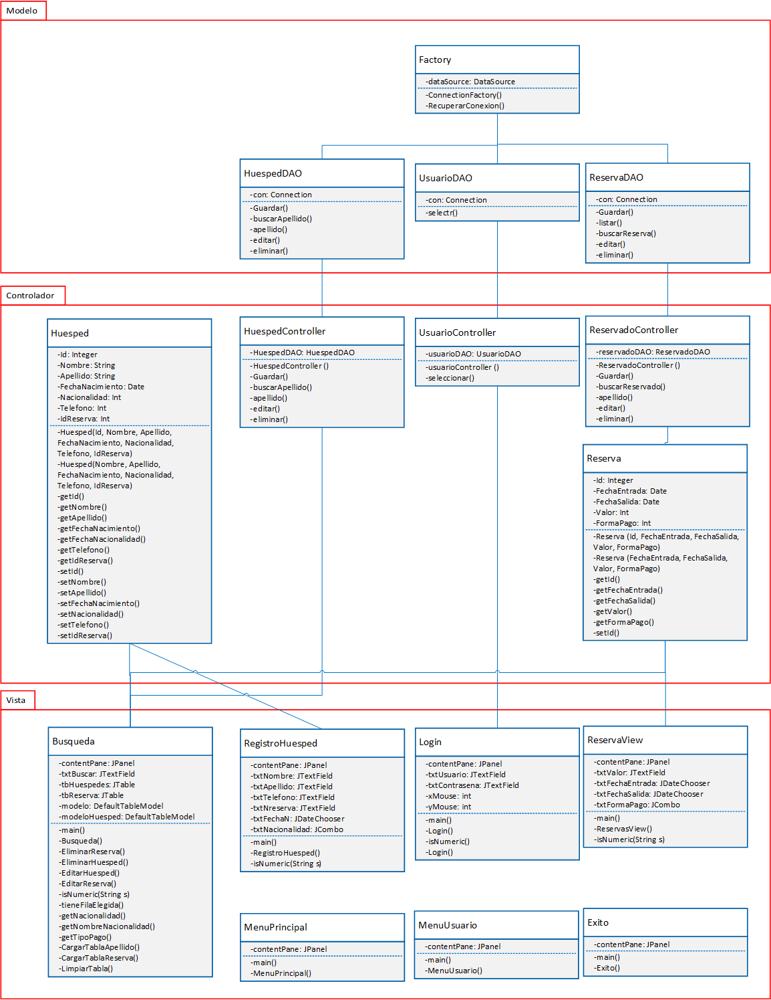

# Hotel Alura

## Tecnologias usadas
- Java
- Eclipse
- Biblioteca JCalendar
- MySql
- Plugin WindowBuilder

## Descargar JCalendar
Tras realizar la importación a tu editor, es necesario instalar la librería JCalendar, de lo contrário, el proyecto presentará un error y no será posible abrir la ventana de Reservas.

Para instalar, se necesita descargar el paquete a través de ese enlace: 
[JCalendar](https://toedter.com/jcalendar/)

- Descomprime el archivo
- Agregar el .jar dando clic en el nombre del proyecto, luego presionar "Properties" ir a la pestaña "Libraries" eliminar y luego agregar el .jar desde la carpeta lib descomprida, agregar los 4 .jar presionar "Apply and close" .

## El conector Mysql
Se debe tener instalado antes Mysql para luego ir a la siguiente dirección
- C:\Program Files (x86)\MySQL\Connector J 8.0

Hacer los mismos paso que JCalendar

## Crear una base de datos
El diseño de la base de datos será el siguiente


### Modelo de base de datos
El codigo SQL para MySQL se muestra a continuación.

```
CREATE DATABASE IF NOT EXISTS HOTEL;
USE HOTEL;


CREATE TABLE IF NOT EXISTS RESERVA(
Id INT PRIMARY KEY AUTO_INCREMENT,
FechaEntrada TIMESTAMP DEFAULT CURRENT_TIMESTAMP ,
FechaSalida TIMESTAMP,
Valor DOUBLE NOT NULL,
FormaPago INT NOT NULL
);

CREATE TABLE IF NOT EXISTS HUESPED(
Id INT PRIMARY KEY AUTO_INCREMENT,
Nombre VARCHAR(50) NOT NULL,
Apellido VARCHAR(50) NOT NULL,
FechaNacimiento TIMESTAMP NOT NULL,
Nacionalidad INT NOT NULL,
Telefono INT NOT NULL,
IdReserva INT NOT NULL,
FOREIGN KEY(IdReserva ) REFERENCES RESERVA(Id) ON DELETE CASCADE ON UPDATE CASCADE
);

CREATE TABLE IF NOT EXISTS Usuario(
Id INT PRIMARY KEY AUTO_INCREMENT,
User VARCHAR(50) NOT NULL,
Password VARCHAR(50) NOT NULL
);

```

Insertar

```
INSERT INTO HUESPED(Nombre, Apellido, FechaNacimiento, Nacionalidad, Telefono, IdReserva) VALUE('Lucia','Mendez','2002-03-01',2,45698758,1);

INSERT INTO Usuario(User, Password) VALUES('Admin','Admin');
INSERT INTO Usuario(User, Password) VALUES('root','root');

INSERT INTO RESERVA(FechaEntrada,FechaSalida,Valor,FormaPago) VALUES('24-02-2000','24-01-2000',1000,1);
```
Selecccionar

```
SELECT Id, FechaEntrada, FechaSalida, Valor, FormaPago FROM Reserva;

SELECT Id, Nombre, Apellido, FechaNacimiento, Nacionalidad, Telefono, IdReserva FROM Huesped WHERE Apellido LIKE 'Per%';

SELECT Id, FechaEntrada, FechaSalida, Valor, FormaPago FROM Reserva WHERE Id=2;
```
Update
```
UPDATE Reserva SET FechaEntrada='2023-04-01', FechaSalida='2023-04-07', Valor=1000.0, FormaPago=1 WHERE Id=1;

UPDATE Huesped SET  Nombre='', Apellido='', FechaNacimiento='', Nacionalidad=1, Telefono=1, IdReserva=1 WHERE Id=1;
```
Eliminar
```
DELETE FROM Reserva WHERE Id=16;
DELETE FROM Huesped WHERE Id=16;
```
## Modelo Vista Controlador


## Pool de conexiones
Para mantener el control del número de conexiones se usa "ConnectionFactory", se configuro con 10 conexiones como máximo.

## Ejecución del programa
A continuación se muestra la ejecución del programa.
